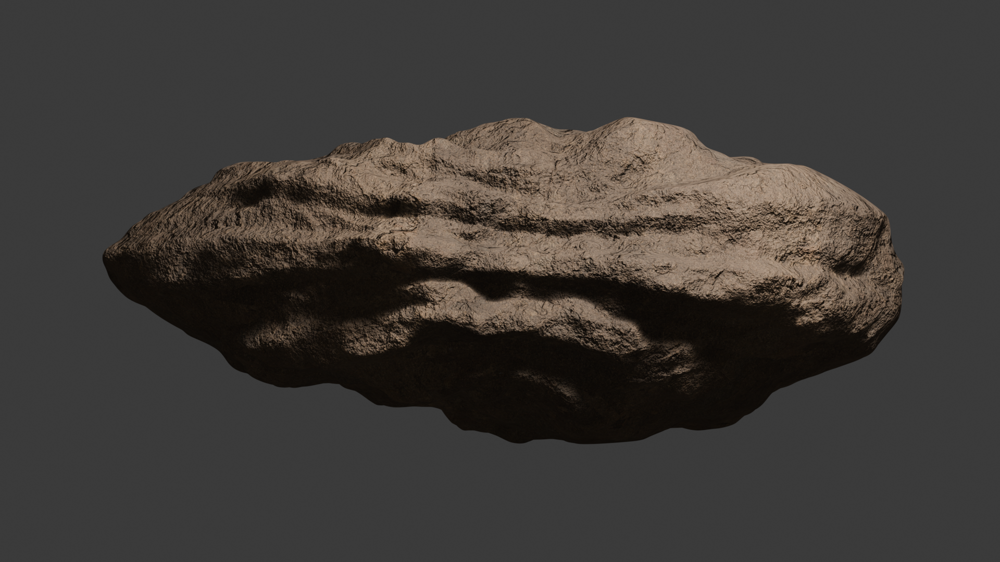
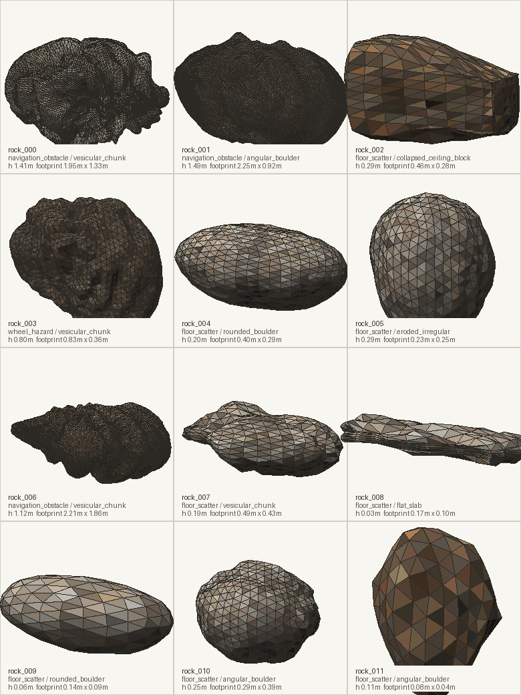

# Rocky

Rocky is a procedural rock and boulder generator for cave, terrain, robotics simulation, and game-environment workflows. It creates varied OBJ or GLB rock assets, assigns texture sets from `textures/`, then writes previews and metadata reports so generated batches can be inspected and reused by a larger procedural terrain pipeline.

The current focus is lava-tube style terrain for rover simulation: small floor scatter, wheel hazards, flat slabs, angular blocks, vesicular lava, and larger boulders that stay below 2m.



Rock_001

### Preview renderer



The preview renderer samples each rock's assigned diffuse texture through its generated UVs, then applies simple directional lighting. Full generated contact sheet: [docs/images/batch_preview.png](docs/images/batch_preview.png)

## What It Generates

Each generated rock folder contains mesh assets, material references, and machine-readable placement metadata:

```text
outputs/batch_001/
  preview.png
  report.json
  report.md
  rock_000/
    rock_000.obj
    rock_000.mtl
    material.json
    info.json
```

The default batch contains a mix of simulation roles:

| Category | Count in default seed |
| --- | ---: |
| `floor_scatter` | 28 |
| `wheel_hazard` | 5 |
| `navigation_obstacle` | 3 |

Shape families in the default config:

| Shape | Purpose |
| --- | --- |
| `rounded_boulder` | smooth basalt-like rocks |
| `angular_boulder` | rougher broken rocks |
| `flat_slab` | low flat pieces that should lie stable on the floor |
| `collapsed_ceiling_block` | blocky cave debris |
| `vesicular_chunk` | pitted volcanic pieces |
| `ropy_lava_fragment` | elongated lava-flow fragments |
| `eroded_irregular` | odd but still plausible worn rocks |

With the default seed and `resolution_scale: 1.0`, the current batch ranges from 0.02m to 1.49m high, with face counts from 192 to 20,480 depending on size class and base topology.

## Quick Start

Install dependencies:

```bash
python3 -m pip install -e .
```

Generate a batch:

```bash
python3 run.py
```

Optional run overrides:

```bash
python3 run.py --count 12 --seed 9001
python3 run.py --output-dir outputs/test_batch
```

The active config is always [configs/config.json](configs/config.json). A clean reference template is available at [configs/template.json](configs/template.json).

## Pipeline

Rocky is organized as an object-oriented layered pipeline:

1. `TrimeshRockLayer` creates an ico-sphere or rounded subdivided box and deforms it with large-scale noise, ridged masks, strata, fracture planes, pitting, and ropy lava ridges.
2. `UvProjectionLayer` computes per-face UVs from the final mesh.
3. Texture assignment selects a compatible texture set from `textures/`.
4. Exporters write OBJ/MTL, `material.json`, and optional GLB files.
5. Reporters write PNG previews, batch reports, and per-rock `info.json` files.

## Configuration

Important top-level fields:

```json
{
  "seed": 1337,
  "count": 36,
  "output_dir": "outputs/batch_001",
  "texture_dir": "textures",
  "export_formats": ["obj"],
  "max_height": 2.0,
  "resolution_scale": 1.0
}
```

`resolution_scale` is a global mesh-resolution multiplier. It scales each size class's `subdivisions`:

```text
sampled_subdivisions = round(size_class.subdivisions * resolution_scale)
```

Examples:

| Value | Effect |
| ---: | --- |
| `0.5` | lighter simulation batch |
| `1.0` | default proportional density |
| `1.5` | higher detail visual inspection |

The final sampled subdivision value is clamped between `0` and `6`.

Default size classes:

| Size class | Height range | Diameter range | Base subdivisions | Typical ico-sphere faces |
| --- | ---: | ---: | ---: | ---: |
| `floor_pebble` | 0.03m - 0.12m | 0.04m - 0.18m | 1 | 80 |
| `floor_cobble` | 0.10m - 0.35m | 0.12m - 0.55m | 2 | 320 |
| `step_rock` | 0.35m - 0.85m | 0.35m - 1.15m | 3 | 1,280 |
| `rover_obstacle` | 0.85m - 1.85m | 0.75m - 2.40m | 4 | 5,120 |

Box-based rocks use a different base topology, but follow the same proportional idea.

## Archetypes

Each archetype controls shape, material preference, and deformation behavior:

```json
{
  "name": "vesicular_lava",
  "weight": 5,
  "shape_type": "vesicular_chunk",
  "material_type": "porous_lava",
  "base_shape": "icosphere",
  "roughness": 0.95,
  "fractures": 0.80,
  "cracks": 1.10,
  "angularity": 0.62,
  "spike_limit": 0.82,
  "fracture_strength": 0.06,
  "pitting_intensity": 0.95
}
```

Useful archetype fields:

| Field | Purpose |
| --- | --- |
| `shape_type` | Semantic shape label used in previews, reports, and placement metadata |
| `material_type` | Texture-family hint such as `dark_basalt`, `porous_lava`, or `layered_cliff` |
| `base_shape` | `icosphere` for rounded forms, `box` for slabs and blocks |
| `roughness` | Multiplier for displacement intensity |
| `angularity` | Strength of faceted/ridged deformation |
| `spike_limit` | Clamp to suppress needle-like artifacts |
| `fracture_strength` | Geometric fracture-plane chipping and shearing |
| `pitting_intensity` | Vesicular lava-style depressions |
| `ropy_strength` | Directional lava-flow ridges |

## Textures And Materials

Texture sets are discovered under `textures/` by filename:

```text
*_diff_*
*_nor_* or *_normal_*
*_rough_*
*_disp_* or *_height_*
```

OBJ exports use one material file per rock. The `.obj` references the `.mtl`, and the `.mtl` references the original texture files by relative path:

```text
map_Kd    diffuse/albedo
map_Bump  normal
map_Pr    roughness
disp      displacement
```

Texture files are not copied into every rock directory, which keeps generated batches much smaller. GLB exports are currently lightweight mesh exports and do not embed the 4K texture maps.

Each rock also gets a renderer-agnostic `material.json` sidecar. This is the preferred file for custom simulation or terrain importers because it contains a complete material recipe instead of relying on MTL conventions:

```json
{
  "schema": "rocky.material.v1",
  "material_name": "rock_material",
  "shader_model": "pbr_metallic_roughness",
  "uv": {
    "source": "mesh_uv",
    "tiling": [2.25, 2.25],
    "wrap": "repeat"
  },
  "pbr": {
    "metallic": 0.0,
    "roughness_default": 0.86,
    "normal_strength": 1.0,
    "displacement_midlevel": 0.5,
    "displacement_scale_m": 0.085
  },
  "maps": {
    "diffuse": {"usage": "base_color", "color_space": "sRGB"},
    "normal": {"usage": "normal", "color_space": "linear", "normal_convention": "OpenGL"},
    "roughness": {"usage": "roughness", "color_space": "linear"},
    "displacement": {"usage": "displacement", "color_space": "linear"}
  }
}
```

## Metadata For Terrain Placement

Every rock folder contains `info.json`. Downstream procedural terrain generation should use this file instead of parsing filenames or preview labels.

Example placement block:

```json
{
  "label": "floor_scatter/flat_slab",
  "source_label": "floor_cobble/flat_lava_slab",
  "height_m": 0.0296,
  "footprint_radius_m": 0.0838,
  "drive_over": true,
  "collision_category": "floor_scatter",
  "orientation": {
    "local_up_axis": "Y",
    "bottom_y": -0.0143,
    "align_local_up_to_terrain_normal": true,
    "allow_random_yaw": true,
    "yaw_range_deg": [0.0, 360.0],
    "max_pitch_deg": 6.0,
    "max_roll_deg": 6.0,
    "stability_hint": "lay_flat"
  }
}
```

Recommended terrain placement:

1. Pick rocks by `placement_role`, `shape_type`, and dimensions.
2. Place the local bottom at the terrain contact point.
3. Align local `Y` to the terrain normal.
4. Randomize yaw freely.
5. Clamp pitch and roll using `max_pitch_deg` and `max_roll_deg`.
6. Use `drive_over` and `collision_category` to decide collision and navigation behavior.

Flat rocks get tight tilt limits and `lay_flat`; rounded rocks allow more orientation variation; rover obstacles stay mostly upright on their generated flattened base.

## Import And Material Notes

OBJ files are exported with:

```text
s off
```

and one normal per triangle, preserving the faceted fracture look in mesh viewers and simulation importers.

For OBJ import, use the `.obj` file. The OBJ references its `.mtl`, and the MTL references the texture maps. Keep the generated asset folders and `textures/` folder in the same relative layout so downstream tools can resolve those paths.

## Reports And Inspection

Each run writes:

| File | Purpose |
| --- | --- |
| `preview.png` | Batch contact sheet with labels |
| `report.md` | Human-readable table of rocks, dimensions, faces, cracks, and fractures |
| `report.json` | Full machine-readable batch report |
| `rock_xxx/material.json` | Renderer-agnostic PBR material recipe |
| `rock_xxx/info.json` | Per-rock metadata for terrain placement |

The terminal also prints a Rich progress bar and a summary table with counts by size class, placement role, shape, and material.

## Development

Run tests:

```bash
PYTHONPATH=src python3 -m unittest discover -s tests -p 'test_*.py'
```

Or, when using the local virtual environment:

```bash
PYTHONDONTWRITEBYTECODE=1 PYTHONPATH=src venv/bin/python -m unittest discover -s tests -p 'test_*.py'
```

Rocky uses Trimesh for mesh primitives/export, NumPy for deformation, Pillow for PNG previews, and Rich for terminal progress.

All generation is seeded. Reusing the same config and seed produces the same batch.
